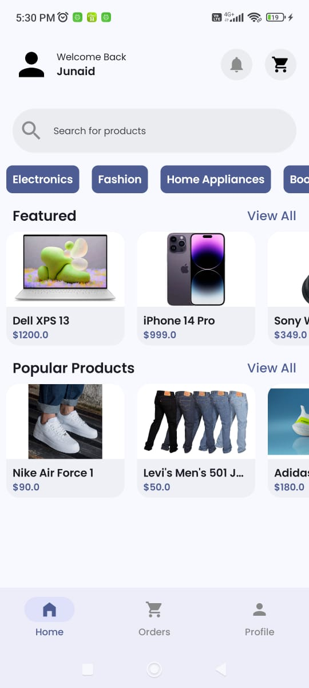
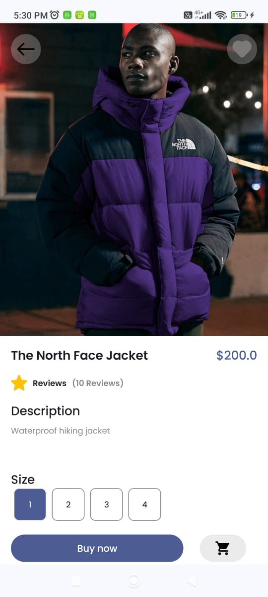
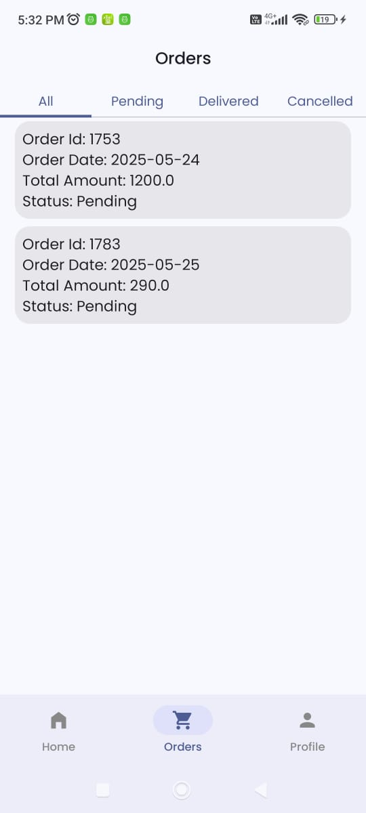

# 🛍️ Shopping App

A modern, clean, and scalable Shopping Application built using Kotlin and Jetpack Compose, following the MVVM architecture pattern. It supports seamless product browsing, detailed views, cart management, and a complete checkout experience. The app is modular and leverages best practices including dependency injection, asynchronous programming, and declarative UI.

---

## 📱 Features

- 🔐 **Authentication**
  - User Registration
  - Secure Login
- 🛍️ **Product Catalog**
  - View all available items
  - Item detail view with full description
- 🛒 **Cart Management**
  - Add/remove items to/from cart
  - Dynamic cart updates
- 💳 **Checkout Process**
  - Complete checkout with summary
- 📦 **Order History**
  - View past orders and details
- 👤 **User Profile**
  - View and update profile information

---

## ⚙️ Tech Stack

| Category               | Technology              |
|------------------------|-------------------------|
| Language               | Kotlin                  |
| Architecture           | MVVM                    |
| UI Toolkit             | Jetpack Compose         |
| Navigation             | Jetpack Navigation      |
| Dependency Injection   | Koin                    |
| Networking             | Ktor                    |
| Image Loading          | Coil                    |
| Asynchronous Handling  | Kotlin Coroutines       |
| State Management       | StateFlow / LiveData    |

## 📸 Screenshots

### 🏠 Home Screen

### 🛒 Cart Screen

### 📦 Order History

## Let me know if you want to:

- Include API details (endpoints, request format, etc.)
- Write a `CONTRIBUTING.md` or changelog
